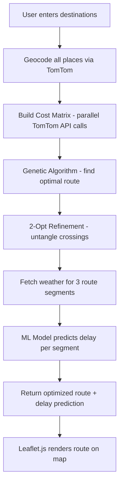

<div align="center">
  
  
  
  
  
  
  <br />
  <br />
  
  <h1>🚀 RouteWise AI</h1>
  <p><b>Next-Generation Route Optimization & Intelligent Transport Recommendations</b></p>
  
  <h2><a href="https://pbl-routewiseai.onrender.com/">✨ TRY THE LIVE DEMO HERE ✨</a></h2>

  <p>RouteWise AI is a premium, AI-powered travel platform designed to mathematically optimize your road trips and intelligently recommend multi-modal transport options across India. Built with a sleek glassmorphism UI, powered by a robust Python backend, and enhanced with a <b>real-data trained ML model</b>.</p>

  <br />
</div>

## ✨ Key Features

🚗 **AI Route Optimization (Traveling Salesperson)**
Utilizes a powerful **Genetic Algorithm** seeded with a greedy nearest-neighbor approach and refined with **2-Opt local search**. It calculates routes using *live traffic data* from the TomTom API, not just straight-line distances.

⛅ **ML-Powered Delay Prediction**
A **RandomForest ML model** trained on **117,600 real-world data samples** from 30 Indian cities predicts travel delays by analyzing distance, traffic levels, weather severity, time-of-day, and day-of-week — achieving an **R² score of 0.89**.

🚊 **Smart Transport Options**
Instantly query a comprehensive database of **38,000+ real-world flight, train, and bus routes** across India to find the most cost-effective and fastest travel methods.

👤 **Persistent Garage & Profiles**
Secure user authentication allows users to maintain a persistent profile and virtual "Garage" to track their vehicles across devices.

---

## 🧠 Machine Learning Pipeline

### Model Architecture

| Component | Details |
|-----------|---------|
| **Algorithm** | RandomForestRegressor (scikit-learn) |
| **Training Data** | 117,600 samples from 30 Indian cities |
| **Data Source** | Real TomTom Routing API + OpenWeatherMap API |
| **Features** | 9 engineered features |
| **R² Score** | **0.8923** |
| **MAE** | 11.85 minutes |
| **RMSE** | 18.30 minutes |

### 9 Input Features

| # | Feature | Description |
|---|---------|-------------|
| 1 | `distance_km` | Route distance in kilometers |
| 2 | `traffic_level` | Real-time traffic congestion (1–10) |
| 3 | `weather_encoded` | Weather severity score (1–9) |
| 4 | `hour_of_day` | Hour of travel (0–23) |
| 5 | `day_of_week` | Day of travel (0=Mon, 6=Sun) |
| 6 | `is_rush_hour` | Binary flag for peak hours (7–9 AM, 4–6 PM) |
| 7 | `traffic_weather_interaction` | traffic_level × weather_severity |
| 8 | `rush_hour_traffic` | traffic_level × is_rush_hour |
| 9 | `distance_weather_risk` | distance_km × weather_severity |

### Training Pipeline (`train_model.py`)

```
┌─────────────────────────────────────────────────────────┐
│  Step 1: Fetch Real Data                                │
│  • 200 route pairs via TomTom Routing API               │
│  • Live weather from OpenWeatherMap API                 │
│  • 30 Indian cities (metros + tier 1/2/3)               │
├─────────────────────────────────────────────────────────┤
│  Step 2: Data Augmentation                              │
│  • 14 time slots × 7 days × 6 weather conditions       │
│  • 200 routes → 117,600 training samples                │
├─────────────────────────────────────────────────────────┤
│  Step 3: Model Training                                 │
│  • RandomForestRegressor (100 trees, max_depth=12)      │
│  • 80/20 train-test split                               │
│  • GridSearchCV hyperparameter tuning                   │
├─────────────────────────────────────────────────────────┤
│  Step 4: Evaluation & Export                            │
│  • R²=0.89 | MAE=11.85 min | RMSE=18.30 min            │
│  • Saved to backend/model/delay_model.pkl               │
└─────────────────────────────────────────────────────────┘
```

### 30 Cities Covered

> **Metros:** Delhi, Mumbai, Bangalore, Chennai, Kolkata, Hyderabad
> **Tier 1:** Pune, Ahmedabad, Jaipur, Lucknow
> **Tier 2:** Chandigarh, Indore, Bhopal, Nagpur, Patna, Kochi, Coimbatore, Visakhapatnam, Vadodara, Surat
> **Tier 3:** Mysore, Varanasi, Amritsar, Guwahati, Dehradun, Ranchi, Bhubaneswar, Thiruvananthapuram, Jodhpur, Agra

### Retrain the Model

```bash
# Full mode — fetches real data from TomTom & OpenWeatherMap APIs (~25 min)
python train_model.py

# Quick mode — synthetic data only, no API calls (~30 sec)
python train_model.py --quick
```

---

## 🛠️ Technology Stack

### Backend
- **Framework:** FastAPI (Python)
- **Database:** PostgreSQL hosted on Supabase
- **ORM:** SQLAlchemy (with ultra-fast `execute_values` bulk inserts)
- **ML Model:** RandomForestRegressor (scikit-learn) trained on real API data
- **Algorithms:** Genetic Algorithms, 2-Opt Refinement, Asynchronous API pooling

### Frontend
- **Design:** Modern Glassmorphism & Micro-animations
- **Styling:** TailwindCSS
- **Mapping:** Leaflet.js
- **Interactivity:** Vanilla JavaScript

### External APIs
- **TomTom Routing API:** Live traffic, base travel time, and route pathing.
- **OpenWeatherMap API:** Live weather segment analysis.
- **TomTom Geocoding API:** Coordinate resolution.

---

## 📁 Project Structure

```
routewiseAI/
├── backend/
│   ├── main.py              # FastAPI application & API endpoints
│   ├── delay_predictor.py   # ML prediction engine (loads trained model)
│   ├── optimizer.py         # Genetic Algorithm + 2-Opt route optimizer
│   ├── router.py            # Route calculation & orchestration
│   ├── tomtom_api.py        # TomTom API integration
│   ├── weather_api.py       # OpenWeatherMap API integration
│   ├── database.py          # Supabase/PostgreSQL connection
│   └── model/
│       └── delay_model.pkl  # Pre-trained ML model (real data)
├── frontend/                # Static HTML/CSS/JS frontend
├── train_model.py           # ML training pipeline
├── model/
│   └── training_metrics.json  # Model evaluation metrics
├── load_db.py               # Database loader for transport datasets
├── Dockerfile               # Docker deployment config
├── render.yaml              # Render deployment config
└── new_requirement.txt      # Python dependencies
```

---

## 🚀 Getting Started

### Prerequisites
- Python 3.10+
- PostgreSQL (Supabase recommended)
- API Keys for TomTom and OpenWeatherMap

### Local Installation

1. **Clone the repository**
   ```bash
   git clone https://github.com/MrXGuru/pbl-RoutewiseAi.git
   cd pbl-RoutewiseAi
   ```

2. **Set up Virtual Environment**
   ```bash
   python -m venv venv
   source venv/bin/activate  # On Windows: venv\Scripts\activate
   ```

3. **Install Dependencies**
   ```bash
   pip install -r new_requirement.txt
   ```

4. **Configure Environment Variables**
   Create a `.env` file in the root directory:
   ```env
   DATABASE_URL=postgresql://[user]:[password]@[pooler-url]:6543/postgres
   TOMTOM_API_KEY=your_tomtom_key
   OWM_API_KEY=your_openweathermap_key
   ```

5. **Load the Database**
   *Note: Ensure your `flight`, `train`, and `bus` JSON datasets are in the root folder.*
   ```bash
   python load_db.py
   ```

6. **Run the Application**
   ```bash
   uvicorn backend.main:app --reload
   ```
   Open `http://127.0.0.1:8000` in your browser.

---

## 🔄 How the AI Optimizer Works



1. **Cost Matrix** — Parallel asynchronous calls to TomTom build a true driving-time matrix (seconds, not km).
2. **Genetic Algorithm** — Simulates generations of route mutations, seeded with greedy nearest-neighbor.
3. **2-Opt Refinement** — Local search pass that untangles any crossing paths.
4. **ML Delay Prediction** — The trained RandomForest model analyzes each route segment's distance, traffic, weather, time-of-day, and outputs predicted delay in minutes.
5. **Visualization** — Leaflet.js renders the optimized route with weather overlays.

---

<div align="center">
  <b>Designed with ❤️ by Team MapSquad</b>
</div>
